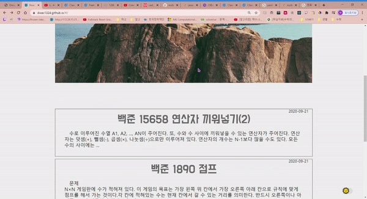
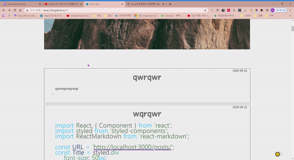
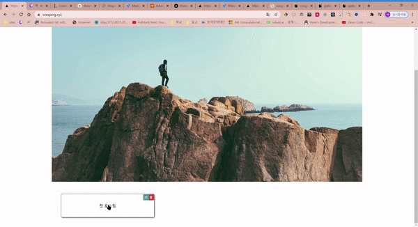

## BLOG 

**[Blog](http://woojong.xyz)**

*2020-09-19*
---
블로그 개설🎉

strapi, react을 사용하여 만들었다.
backend는 헤로쿠 , frontend는 깃헙페이지의 서비스를 이용함.

현명한 사람이라면 시중에 나와있는 서비스로 글을 쓰겠지만

모든 설정을 내가한 나만의 블로그를 가져보고 싶어서 시작하게됐다.

*2020-09-22*
---

strapi를 nodejs로 바꾸었다.
strapi도 충분히 좋았지만 
데이터가 있는 페이지 로딩이 꽤나 오래걸려서 이게 헤로쿠문제인지 
strapi문제인지 몰라서 일단 공부도 할겸 nodejs로 바꾸었다.
결과는 살짝 빨라진거 같다.

로딩하는데 1~2초정도 걸림

약간 빨라진거같다.(아닌가?)

하지만 바꾸게 된 가장 결정적인 이유는 md포맷을 사용해 포스팅해야해서
어디서 복사 붙혀넣기만해도 글이 와장창 깨져버린다..

nodejs에 ckeditor4를 설치해 사용중인데 만족스럽다.
reactMarkdown을 사용해서 일일히 함수를 사용해 파싱했었는데
이제는 html-parse만 해주면 된다.

추가할 것:

pagination, search, tags , about

현재 사용 중 기술:

express-js, mongoDB, react

나중에 써봤으면 하는 기술: 

typescript, aws ec2, 도커, 아폴로, grapql, nestjs

*2020-10-02*
---

**대규모 변경**
javascript -> typescript,

create-react-app-> nextjs

restful api -> graphql, apollo,typegraphql

strapi,heroku,mongodb -> vps(vultr),docker,dokku,express,postgresql,typeorm,redis

가상서버에서 도커를 사용하면서 서버 구축을하니 확실히 빨라졌다.
vultr도 서울리전이 있어서 빠르지만 요금이 얼마나 나올지는 아직 잘 모르겠다.

계속 달려왔는데  이제 천천히 포스팅도 하면서 업데이트 하려고 한다.

workflow나 framwork같은건  

[ben awad](https://www.youtube.com/watch?v=I6ypD7qv3Z8&ab_channel=BenAwad)
를 보면서 많이 배웠다.

덕분에 풀스택에 대한 감을 잡을 수 있었다.

ckeditor를 어떻게 써야할까 고민하던 중에 웹팩만져야한다고 해서
시간이 너무 길어질까봐 일단은 마크다운으로 포스팅하고 필요하면 바꾸려고한다.

확실히 속도도 예전에 비하면 굉장히 빨라졌다!

관리자인증? 같은 구현도 해놨으며 인증시에 편집,삭제,만들기가 가능하다.

추가할 것:

pagination, search, tags , about 