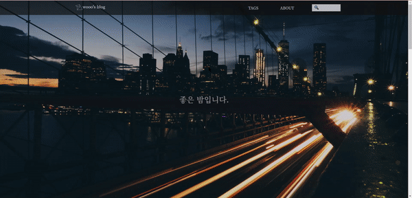

## BLOG

**[Blog](http://woojong.xyz)**

## 2020-09-19\_

블로그 개설🎉

strapi, react을 사용하여 만들었다.
backend는 헤로쿠 , frontend는 깃헙페이지의 서비스를 이용함.

현명한 사람이라면 시중에 나와있는 서비스로 글을 쓰겠지만

모든 설정을 내가한 나만의 블로그를 가져보고 싶어서 시작하게됐다.

## _2020-09-22_

strapi를 nodejs로 바꾸었다.
strapi도 충분히 좋았지만
데이터가 있는 페이지 로딩이 꽤나 오래걸려서 이게 헤로쿠문제인지
strapi문제인지 몰라서 일단 공부도 할겸 nodejs로 바꾸었다.
결과는 살짝 빨라진거 같다.

로딩하는데 1~2초정도 걸림

약간 빨라진거같다.(아닌가?)

하지만 바꾸게 된 가장 결정적인 이유는 md포맷을 사용해 포스팅해야해서
어디서 복사 붙혀넣기만해도 글이 와장창 깨져버린다..

nodejs에 ckeditor4를 설치해 사용중인데 만족스럽다.
reactMarkdown을 사용해서 일일히 함수를 사용해 파싱했었는데
이제는 html-parse만 해주면 된다.

추가할 것:

pagination, search, tags , about

현재 사용 중 기술:

express-js, mongoDB, react

나중에 써봤으면 하는 기술:

typescript, aws ec2, 도커, 아폴로, grapql, nestjs

## _2020-10-02_

**대규모 변경**
javascript -> typescript,

create-react-app-> nextjs

restful api -> graphql, apollo,typegraphql

strapi,heroku,mongodb -> vps(vultr),docker,dokku,express,postgresql,typeorm,redis

가상서버에서 도커를 사용하면서 서버 구축을하니 확실히 빨라졌다.
vultr도 서울리전이 있어서 빠르지만 요금이 얼마나 나올지는 아직 잘 모르겠다.

계속 달려왔는데 이제 천천히 포스팅도 하면서 업데이트 하려고 한다.

workflow나 framwork같은건

[ben awad](https://www.youtube.com/watch?v=I6ypD7qv3Z8&ab_channel=BenAwad)
를 보면서 많이 배웠다.

덕분에 풀스택에 대한 감을 잡을 수 있었다.

ckeditor를 어떻게 써야할까 고민하던 중에 웹팩만져야한다고 해서
시간이 너무 길어질까봐 일단은 마크다운으로 포스팅하고 필요하면 바꾸려고한다.

확실히 속도도 예전에 비하면 굉장히 빨라졌다!

관리자인증? 같은 구현도 해놨으며 인증시에 편집,삭제,만들기가 가능하다.

추가할 것:

pagination, search, tags , about ,footer,

## _2020-10-03_

헬멧, 로고추가

## _2020-10-04_

태그 추가

굉장히 고생 many to many relationship을 typeorm에서 구현하기가 빡센거같음...

typeorm+postgresql로 하다가 외래키, join, orm사용법 등등으로 몇 시간씩 잡아먹는다

족히 하루는 걸렸다 구글링을 10페이지까지해도 안나온다

database쪽 지식을 좀 쌓아야겠다..

## _2020-10-06_

미디어 쿼리 추가

## _2020-10-11_

  
전체적인 ui개선  
요즘 홈페이지를 사용하면서 한 번도 속도에 대한 불만을 가져본적 없는데  
다른 사람의 리액트 기반의 블로그를 봤는데 엄청빨랐다.  
생각해보니까 링크를 타고 다닐 때마다 새로고침이 되는 듯한 느낌이 들었다.  
분명히 리액트를 기반으로한 nextjs인데.. 원래 그런가? 엄청 해매다가  
dynamic link(변수있는 주소)를 쓸 때만 약간의 새로고침이 되었다.  
link를 쓸 때 as를 안쓰고 그냥 바로 변수주소로 넣으니까 해결됐다.  
이제 좀 single application page같당..  
이제 좀 볼만한 듯
